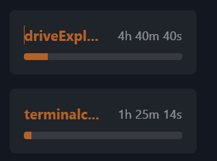

# TerminalCraft Project Submission

## Project Details

1. **What is the name of your project?**
driveExplorer

2. **How many hours did you spend developing this?**
   ~6h (+2.5h reading thru docs, etc.) 
    

3. **Briefly describe what your project is. What makes it unique?**
   Saves a specific folder onto your google drive with the google drive API, could be useful for making backup folders or similar

4. **How many people have tested your extension?**
   ~4

5. **On What operating systems have you tested this project?**
   Windows & Linux
6. **Does your project include a Readme file with instructions on how to use it?**
   Yes
---

## Additional Comments

(Feel free to provide any additional context or notes here)
