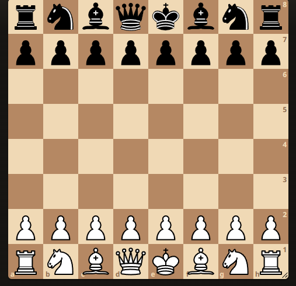
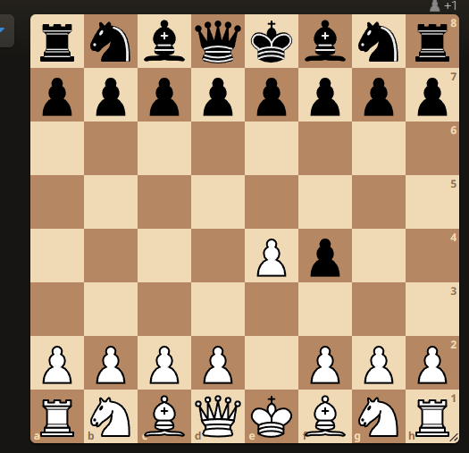
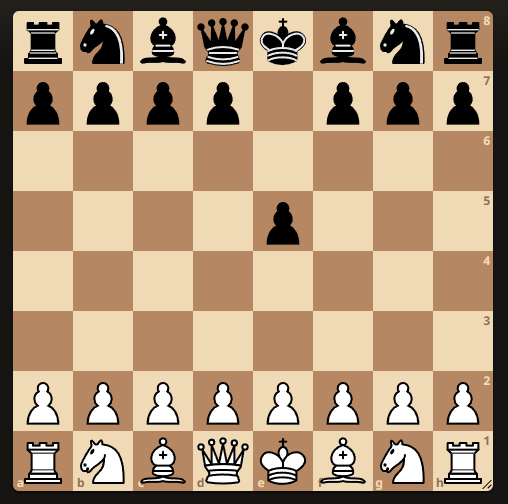
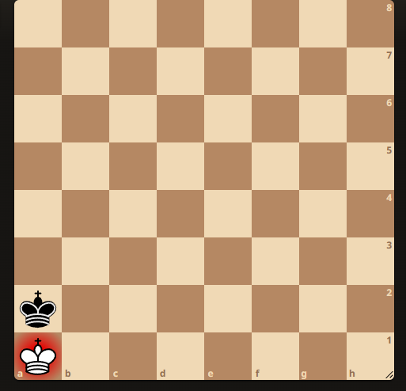

# FEN (Forsyth-Edwards Notation)

Forsyth-Edwards Notation (FEN) is a standard notation for describing a particular board position in a chess game. It encodes the placement of pieces, active color, castling rights, en passant target square, half-move clock, and full-move number.

---
## 📌 Example FEN String:
```
rnbqkbnr/pppppppp/8/8/8/8/PPPPPPPP/RNBQKBNR w KQkq - 0 1
```

---
## 🔍 Breaking Down the FEN String:

### **1️⃣ Board Layout**

Each rank (row) is separated by a `/`, starting from rank 8 (top) to rank 1 (bottom). 
- **Lowercase letters** → Black pieces
- **Uppercase letters** → White pieces
- **Numbers** → Consecutive empty squares

#### 🎯 Example:
```
rnbqkbnr  → Rank 8 (Black major pieces)
pppppppp  → Rank 7 (Black pawns)
8         → Rank 6 (Empty row)
8         → Rank 5 (Empty row)
8         → Rank 4 (Empty row)
8         → Rank 3 (Empty row)
PPPPPPPP  → Rank 2 (White pawns)
RNBQKBNR  → Rank 1 (White major pieces)
```

---
## **2️⃣ Active Color**
- `w` → White to move
- `b` → Black to move

✅ **Example:**
```
rnbqkbnr/pppppppp/8/8/8/8/PPPPPPPP/RNBQKBNR **w** KQkq - 0 1
```
🔹 White has the turn.

---
## **3️⃣ Castling Rights**
- `K` → White can castle kingside
- `Q` → White can castle queenside
- `k` → Black can castle kingside
- `q` → Black can castle queenside
- `-` → No castling available

✅ **Example:**
```
rnbqkbnr/pppppppp/8/8/8/8/PPPPPPPP/RNBQKBNR w **KQkq** - 0 1
```
🔹 Both White and Black can castle on either side.

---
## **4️⃣ En Passant Target Square**
- `-` → No en passant target square
- A square (e.g., `e3`) → En passant capture possible

✅ **Example:**
```
rnbqkbnr/pppppppp/8/8/4Pp2/8/PPPP1PPP/RNBQKBNR w KQkq **e3** 0 2
```

🔹 If White’s pawn moves from `e2` to `e4`, Black can capture en passant at `e3`.

---
## **5️⃣ Half-Move Clock**
- Number of half-moves since the last pawn move or capture (used for the 50-move rule)
- Resets when a pawn moves or a piece is captured

✅ **Example:**
```
rnbqkbnr/pppppppp/8/8/8/8/PPPPPPPP/RNBQKBNR w KQkq - **0** 1
```
🔹 No pawn moves or captures have occurred yet.

---
## **6️⃣ Full-Move Number**
- Starts at `1`
- Increments after Black’s move

✅ **Example:**
```
rnbqkbnr/pppppppp/8/8/8/8/PPPPPPPP/RNBQKBNR w KQkq - 0 **1**
```
🔹 This is the first move of the game.

---
## 🎨 **Visual Representation of FEN**

| Symbol | Piece        | Color  |
|--------|------------|--------|
| `r`    | Rook       | Black  |
| `n`    | Knight     | Black  |
| `b`    | Bishop     | Black  |
| `q`    | Queen      | Black  |
| `k`    | King       | Black  |
| `p`    | Pawn       | Black  |
| `R`    | Rook       | White  |
| `N`    | Knight     | White  |
| `B`    | Bishop     | White  |
| `Q`    | Queen      | White  |
| `K`    | King       | White  |
| `P`    | Pawn       | White  |

---
## **🎯 More Examples:**

### **Mid-Game Example:**
```
rnbqkbnr/pppp1ppp/8/4p3/8/8/PPPPPPPP/RNBQKBNR w KQkq e6 0 2
```

🔹 Black just moved a pawn from `e7` to `e5`, allowing White to capture en passant at `e6`.

### **Endgame Example:**
```
8/8/8/8/8/8/k7/K7 w - - 0 1
```
🔹 Only two kings are left; it's an endgame scenario.

---
## **🔗 External Resources:**
- [Lichess FEN Viewer](https://lichess.org/editor)


---
