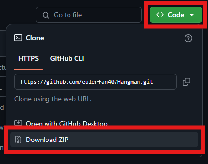
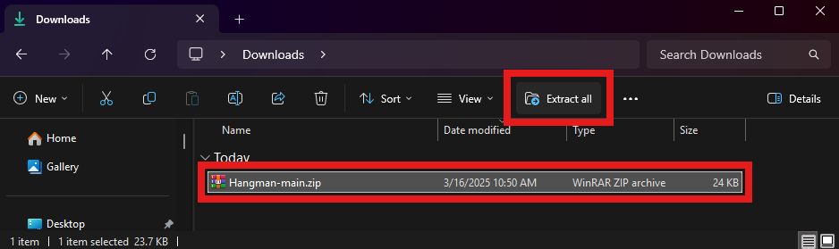
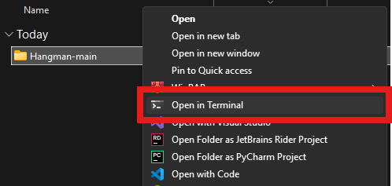
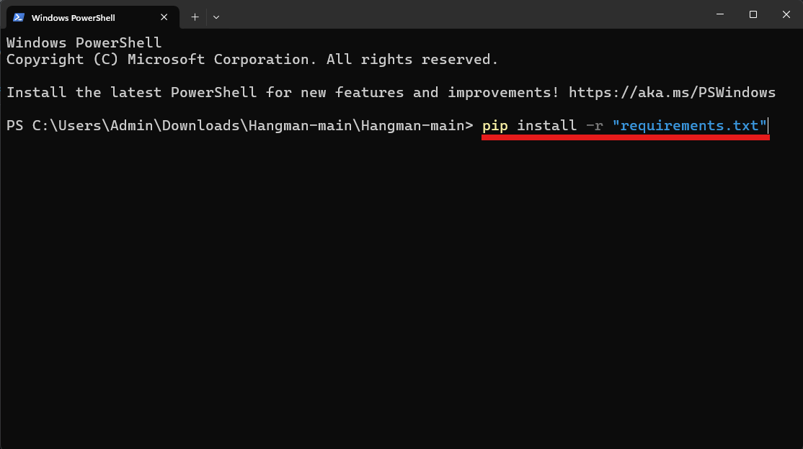
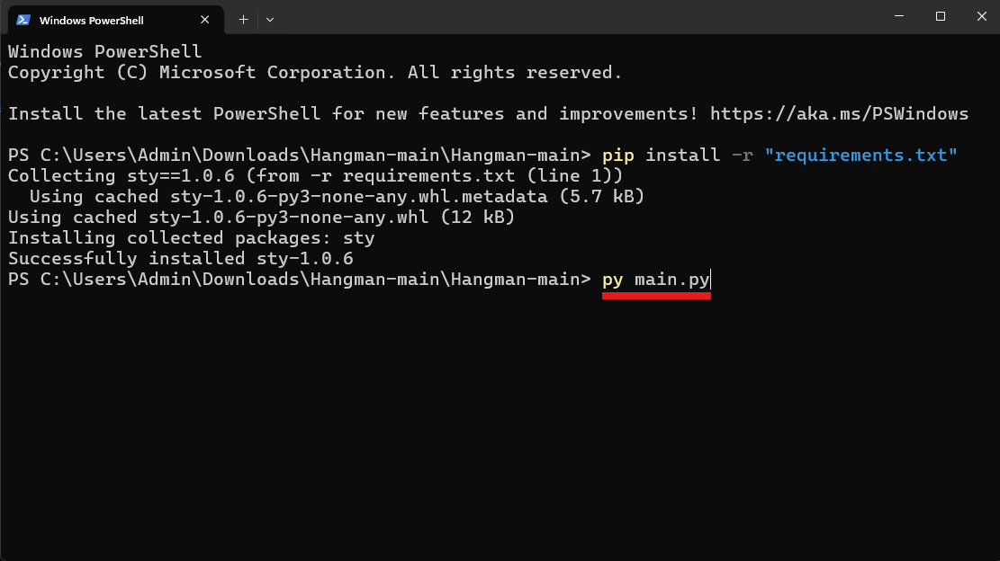

# Hangman 

A terminal-based Hangman game built in Python, featuring color-coded text, ASCII hangman graphics, a customizable word bank with over 5000 words, and a polished user interface. Try to guess the hidden word before you get hanged!

## Features
- **Cross-compatibility** - The program is fully functional in Windows, Mac, and Linux terminals.
- **Color-Coded Interface** – Each part of the program is beautifully color coded using sty.
- **Customizable ASCII Hangman Graphics** – After each incorrect guess, the hangman gains a limb. Frames are read from an external text file which allows for endless creativity.
- **Customizable Word Bank** – Loads words from a customizable external file with over 5000 words.
- **Adaptive Word Reveal** - Correct guesses reveal parts of the word, while wrong ones add to the hangman.
- **Win & Lose Screens** – Clear game-over messages with word reveal.
- **User-Friendly Menu** – Intuitive navigation with play and quit options. Includes incorrect input handling.
- **Replay Support** – Play until you're satisfied!

## Setup Instructions
**1.** Download the code as a **.zip** file.

**2.** Unzip the file.

**3.** Open the unzipped folder. Right click the Hangman-main folder and open it in your terminal.

**4.** Install the dependencies with `pip install -r requirements.txt`.

**5.** Run the program with `py main.py`.

## How to Play
1. Choose **"Play"** from the menu by inputting `1` or `Play`.
2. Guess letters one at a time.
3. Correct guesses reveal parts of the word, while wrong ones add to the hangman.
4. If all the limbs of the hangman are added before you guess the word, you lose.
5. You win by guessing all the letters in the word.

Give it a try and test your word-guessing skills! 🎉