# PNGTools

A comprehensive command line utility for PNG image manipulation.

## Table of Contents
- [Installation](#installation)
- [Usage](#usage)
- [Features](#features)
  - [Basic Operations](#basic-operations)
  - [Color Operations](#color-operations)
  - [Transparency Operations](#transparency-operations)
  - [Advanced Operations](#advanced-operations)

## Installation

### Windows
```bash
# Clone the repository
git clone https://github.com/YeetTheAnson/PNGTools

# Install 
pip install ./PNGTools
```

### Linux
```bash
# Clone the repository
sudo git clone https://github.com/YeetTheAnson/PNGTools

# Install 
sudo pip install ./PNGTools --break-system-packages
```

## Usage

The basic syntax for PNGTools commands is:

```bash
pngtools -i <input_file> -o <output_file> -p <process>
```

Where:
- `-i` specifies the input file
- `-o` specifies the output file (optional for some operations)
- `-p` specifies the process to run
- Additional parameters may be required depending on the process

The full list is:
```
Usage: pngtools -i <input.png> -o <output.png> -p <operation> [options]

Required Arguments:
    -i, --input <file>          Input PNG file
    -o, --output <file>         Output PNG file (not required for info commands)
    -p, --process <operation>   Processing operation to perform on input image

    
Processing Operations:
    transparent         Remove a specific color, making it transparent
        --color <hex>           Color to make transparent (without #)
        --tolerance <percent>   Similar color tolerance (0-100)

    swap-color          Replace one color with another
        --from <hex>            Color to replace (without #)
        --to <hex>              Replacement color (without #)
        --tolerance <percent>   Similar color tolerance (0-100)

    color-tone          Convert all colors to a single tone
        --color <hex>           Target color (without #)

    opacity             Adjust the opacity of the PNG
        --level <percent>       Opacity level (0-100)

    noise               Add noise to the PNG
        --amount <percent>      Noise intensity (0-100)
        --tolerance <percent>   (Optional) Color similarity for noise

    compress            Compress the PNG file
        --level <percent>       Target compression level (0-100)

    convert             Convert image format (png, jpg, webp, base64)
                        Automatically detects format from input and output filename
    
    alpha-extract       Extract alpha channel as a silhouette
        -color <hex>            Silhouette color (without #)

    rotate              Rotate the PNG
        --angle <degrees>       Rotation angle (0-360)

    skew                Skew the PNG along X and/or Y axis
        --x <percent>           Skew amount along X-axis
        --y <percent>           Skew amount along Y-axis

    mirror              Mirror (flip) the PNG
        --horizontal            Flip horizontally
        --vertical              Flip vertically

    text                Add text to the PNG
        --text "<string>"       Text content (in quotes)
        --color <hex>           Text color (without #)
        --size <px>             Font size (in px)
        --bold                  (Optional) Bold text
        --italic                (Optional) Italic text
        --x <px>                X position
        --y <px>                Y position

    pixelate            Pixelate the PNG
        --size <px>             Pixel block size

    blur
        --radius <px>           Blur radius
    
    split-rgba          Split PNG into RGBA components
                        Outputs: <name>_R.png, <name>_G.png, etc.

    center              Center object within a transparent PNG

    border              Add a border around the PNG
        --thickness <px>        Border thickness in pixels
        --color <hex>           Border color (without #)

    round-corners       Round PNG corners (choose one mode)
        (Option 1)              Uniform radius for all corners
        --cornerradius <px>     Corner radius in px

        (Option 2)              Different radius for each corner
        --tl <px>               Corrner radius of top left corner
        --tr <px>               Corrner radius of top right corner
        --bl <px>               Corrner radius of bottom left corner
        --br <px>               Corrner radius of bottom right corner

    multiply            Duplicate the PNG
        --x <n>                 Times to repeat horizontally
        --y <n>                 Times to repeat vertically

    trim                Remove transparent space around object in PNG

    hide-text           Hide a secret message inside the PNG
        --message "<string>"    Message to conceal (in quotes)

        
Information Commands (No output file required):
    analyze             Analyze the PNG file (basic metadata)
    size                Get PNG file size
    color-count         Count the number of unique colors in the PNG
    extract-hidden-text Extract hidden text from PNG
    pick-color          Get color at specific coordinates
        --x <px>                X cooridnate
        --y <px>                Y coordinate
```

## Features

### Basic Operations

#### Analyze Image

```bash
pngtools -i test.png -p analyze
```

Provides detailed information about the image including dimensions, color mode, and file size.

#### Get File Size

```bash
pngtools -i test.png -p size
```

Returns the file size of the image.

#### Count Colors

```bash
pngtools -i test.png -p color-count
```

Counts and returns the number of unique colors in the image.

#### Pick Color from Coordinates

```bash
pngtools -i test.png -p pick-color --x 100 --y 100
```

Returns the color value at the specified coordinates.

#### Rotate Image

```bash
pngtools -i test.png -o rotated.png -p rotate --angle 45
```

Before | After
:-----:|:-----:
 | 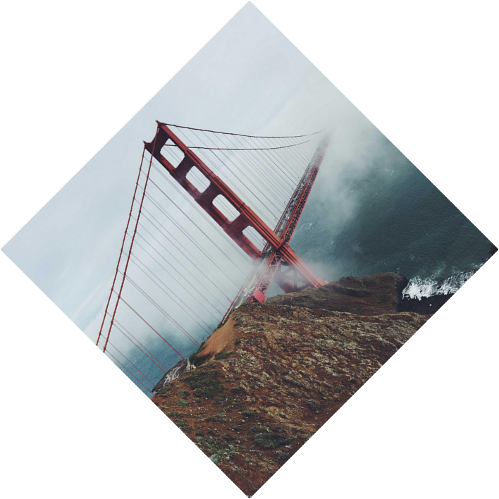

#### Skew Image

```bash
pngtools -i test.png -o skewed.png -p skew --x 20 --y 30
```

Before | After
:-----:|:-----:
 | 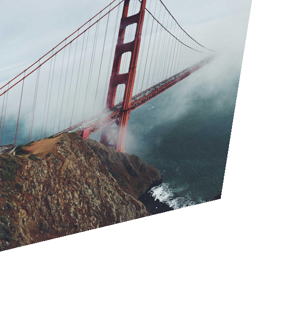

#### Mirror Image

```bash
pngtools -i test.png -o mirror_h.png -p mirror --horizontal
pngtools -i test.png -o mirror_v.png -p mirror --vertical
pngtools -i test.png -o mirror_both.png -p mirror --horizontal --vertical
```

Original | Horizontal | Vertical | Both
:-------:|:----------:|:--------:|:----:
 | 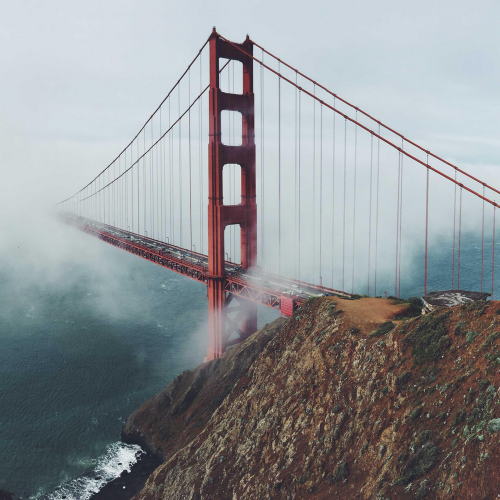 | 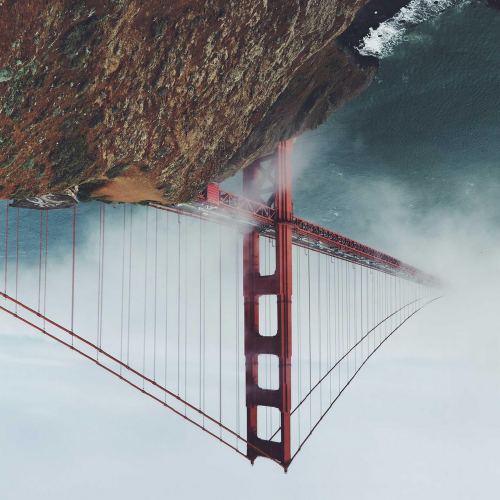 | 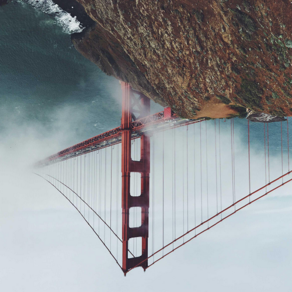

#### Add Text

```bash
pngtools -i test.png -o text.png -p text --text "Hello World" --color FF0000 --size 24 --x 50 --y 50
pngtools -i test.png -o text_bold.png -p text --text "Bold Text" --color 0000FF --size 24 --bold --x 50 --y 50
pngtools -i test.png -o text_italic.png -p text --text "Italic Text" --color 00FF00 --size 24 --italic --x 50 --y 50
```

Original | Regular Text | Bold Text | Italic Text
:-------:|:------------:|:---------:|:----------:
 |  | 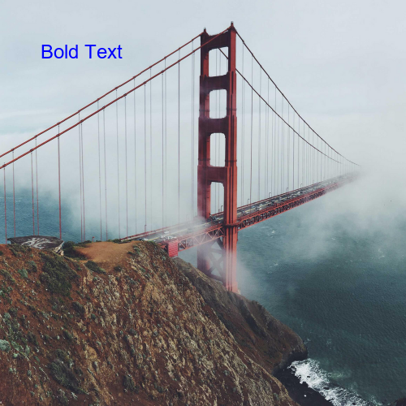 | 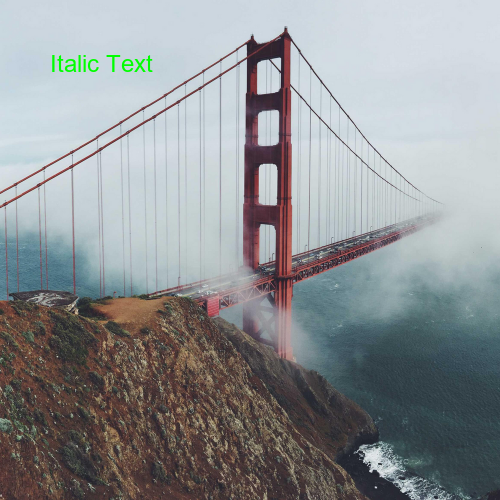

#### Pixelate

```bash
pngtools -i test.png -o pixelated.png -p pixelate --size 8
```

Before | After
:-----:|:-----:
 | 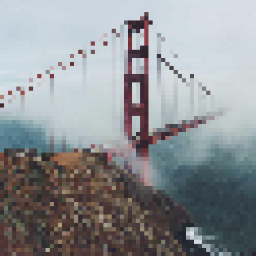

#### Blur

```bash
pngtools -i test.png -o blurred.png -p blur --radius 5
```

Before | After
:-----:|:-----:
 | 

#### Add Border

```bash
pngtools -i test.png -o border_black.png -p border --thickness 10
pngtools -i test.png -o border_red.png -p border --thickness 10 --color FF0000
```

Original | Black Border | Red Border
:-------:|:------------:|:---------:
 | 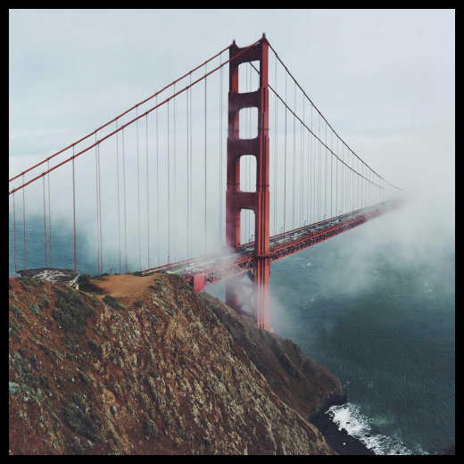 | 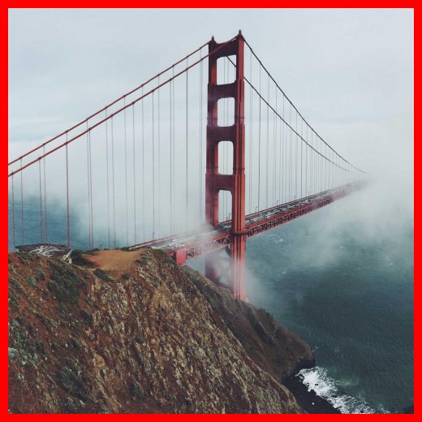

#### Round Corners

```bash
pngtools -i test.png -o round_uniform.png -p round-corners --cornerradius 20
pngtools -i test.png -o round_varied.png -p round-corners --tl 10 --tr 20 --bl 30 --br 40
```

Original | Uniform Corners | Varied Corners
:-------:|:---------------:|:-------------:
 | 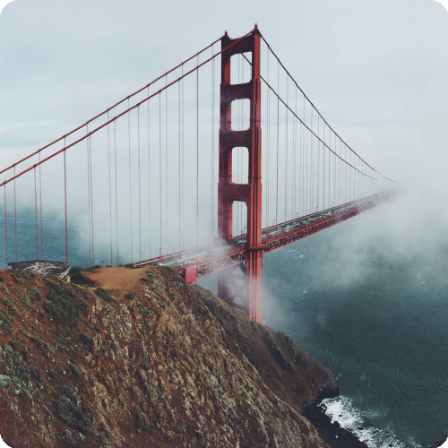 | 

#### Multiply Image

```bash
pngtools -i test.png -o multiply_h.png -p multiply --x 3 --y 1
pngtools -i test.png -o multiply_v.png -p multiply --x 1 --y 3
pngtools -i test.png -o multiply_both.png -p multiply --x 2 --y 2
```

Original | Horizontal Multiply | Vertical Multiply | Both Directions
:-------:|:------------------:|:-----------------:|:--------------:
 | 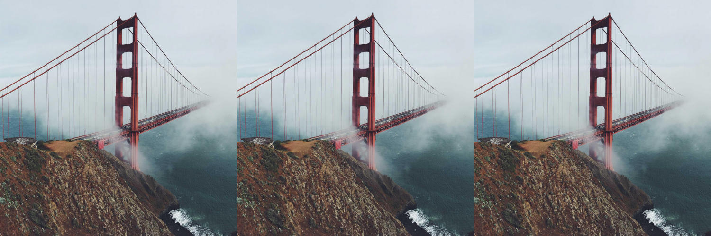 | 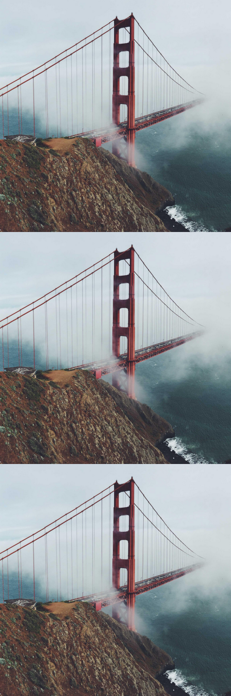 | 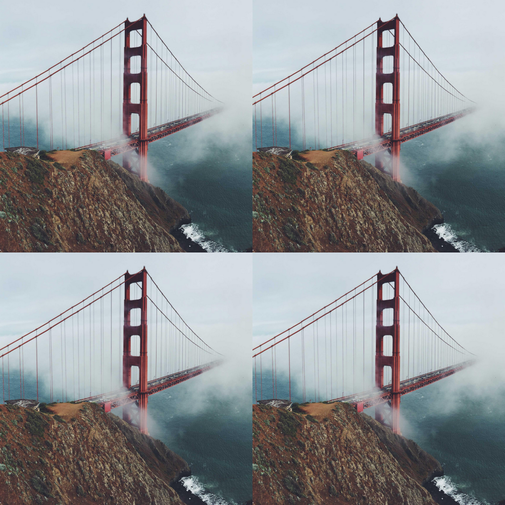

#### Hide and Extract Text

```bash
pngtools -i test.png -o hidden_text.png -p hide-text --message "This is a secret message"
pngtools -i hidden_text.png -p extract-hidden-text
```

Before | After
:-----:|:-----:
 | 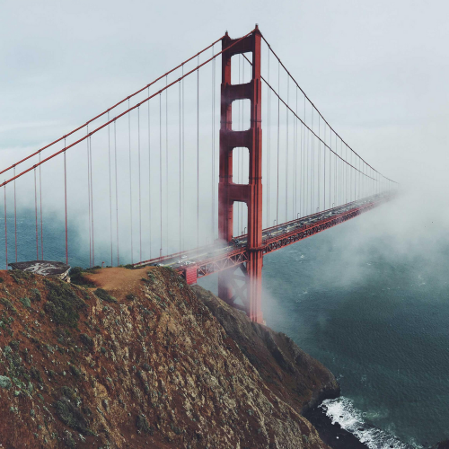

> **Note:** The image with hidden text will appear visually identical to the original. Changes are made at the pixel level and are not visible to the human eye.

### Color Operations

#### Change Color Tone

```bash
pngtools -i test.png -o tone_blue.png -p color-tone --color 0000FF
```

Before | After
:-----:|:-----:
 | 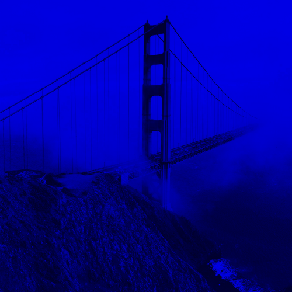

#### Adjust Opacity

```bash
pngtools -i test.png -o opacity_50.png -p opacity --level 50
```

Before | After
:-----:|:-----:
 | 

#### Add Noise

```bash
pngtools -i test.png -o noise_random.png -p noise --amount 20
pngtools -i test.png -o noise_similar.png -p noise --amount 20 --tolerance 30
```

Original | Random Noise | Similar Noise
:-------:|:------------:|:------------:
 |  | 

#### Compress Image

```bash
pngtools -i test.png -o compressed_low.png -p compress --level 20
pngtools -i test.png -o compressed_medium.png -p compress --level 50
pngtools -i test.png -o compressed_high.png -p compress --level 80
```

Original | Low Compression | Medium Compression | High Compression
:-------:|:---------------:|:------------------:|:---------------:
 |  |  | 

> **Warning:** Compression changes may not be visibly apparent in the examples, but file sizes will be reduced. Higher compression levels may result in some visual quality loss.

#### Convert Formats

```bash
pngtools -i test.png -o converted.jpg -p convert
pngtools -i test.png -o converted.webp -p convert
pngtools -i test.png -o converted.txt -p convert
```

> **Note:** Format conversion doesn't produce visible changes in this README but converts the image to different file formats.

### Transparency Operations

#### Make Background Transparent

```bash
pngtools -i solid_bg.png -o transparent_bg.png -p transparent --color FFFFFF --tolerance 10
```

Before | After
:-----:|:-----:
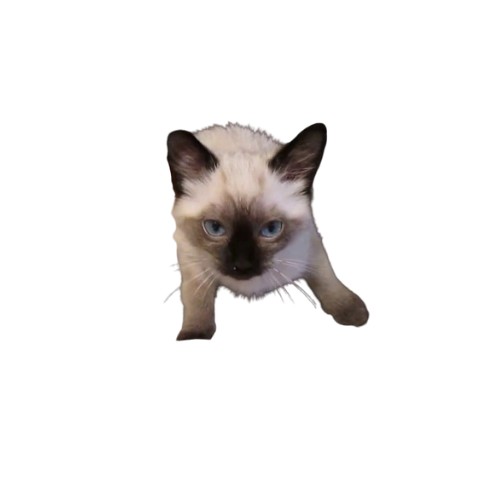 | 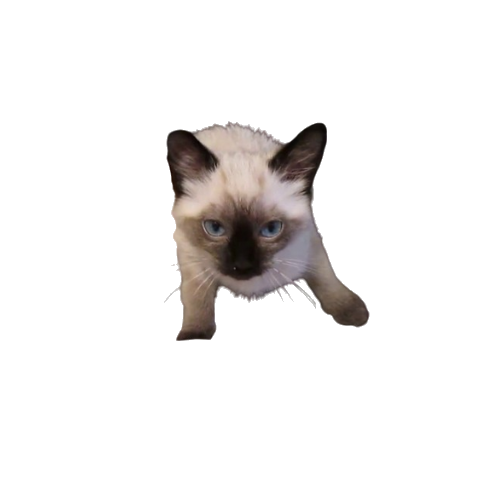

#### Swap Background Color

```bash
pngtools -i solid_bg.png -o swapped_bg.png -p swap-color --from FFFFFF --to 00FF00 --tolerance 10
```

Before | After
:-----:|:-----:
 | 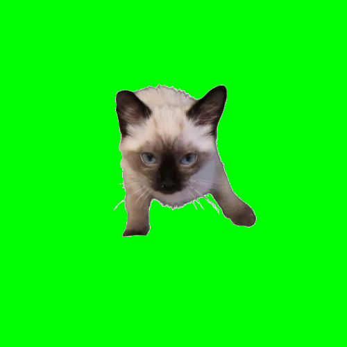

#### Center Object within Transparent PNG

```bash
pngtools -i transparent.png -o centered.png -p center
```

Before | After
:-----:|:-----:
 | 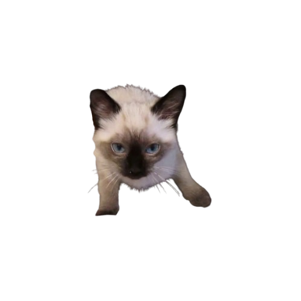

#### Trim Transparent Space

```bash
pngtools -i transparent.png -o trimmed.png -p trim
```

Before | After
:-----:|:-----:
 | 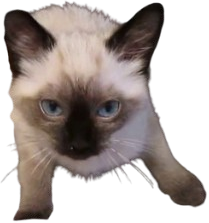

#### Extract Alpha Channel

```bash
pngtools -i transparent.png -o alpha_extracted.png -p alpha-extract --color 000000
```

Before | After
:-----:|:-----:
 | 

### Advanced Operations

#### Split RGBA Channels

```bash
pngtools -i colorful_transparent.png -o rgba_split.png -p split-rgba
```

Before | After (Red) | After (Green) | After (Blue) | After (Alpha) |
:-----:|:-----:|:-----:|:-----: |:-----: |
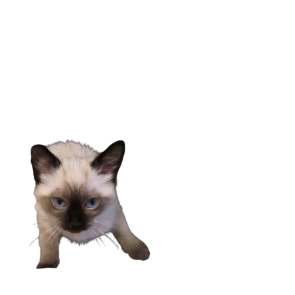 | 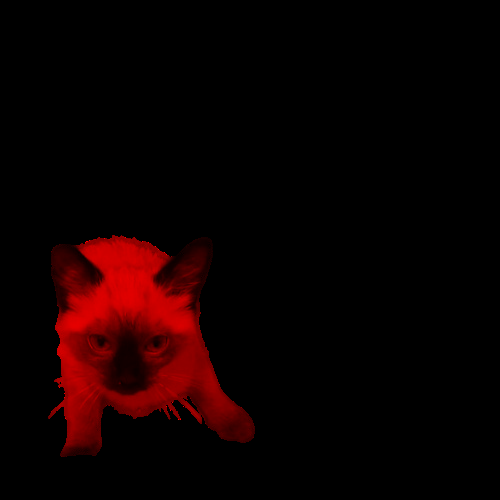 | 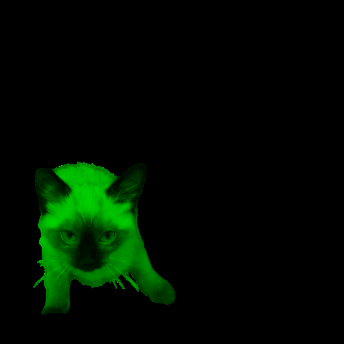 | 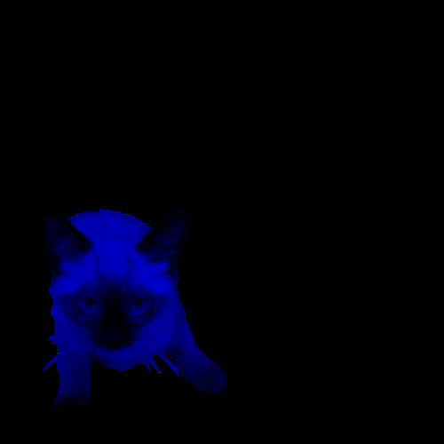 | 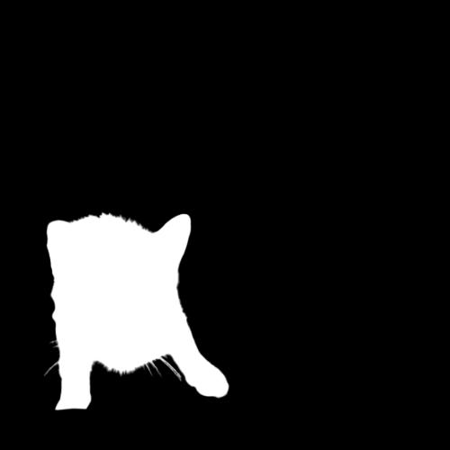 |

#### Base64 Conversion

```bash
# Convert PNG to base64
pngtools -i test.png -o test_base64.txt -p convert

# Process base64 image
pngtools -i test_base64.txt -o restored.png -p convert
```

Original | Restored from Base64
:-------:|:-------------------:
 | 

> **Note:** The base64 conversion process should result in an identical image being restored.

## Advanced Testing Scenarios

### Color Swapping with Different Tolerances

```bash
pngtools -i color_test.png -o swap_t5.png -p swap-color --from FF0000 --to 00FF00 --tolerance 5
pngtools -i color_test.png -o swap_t15.png -p swap-color --from FF0000 --to 00FF00 --tolerance 15
pngtools -i color_test.png -o swap_t30.png -p swap-color --from FF0000 --to 00FF00 --tolerance 30
```

Original | Tolerance 5 | Tolerance 15 | Tolerance 30
:-------:|:-----------:|:------------:|:------------:
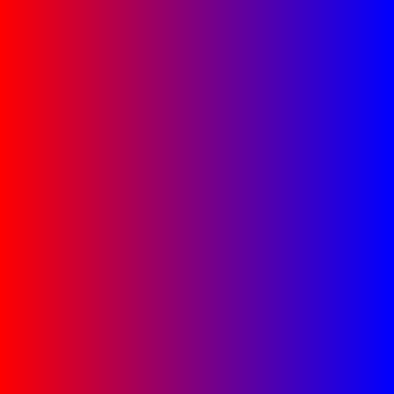 | 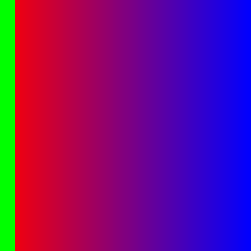 | 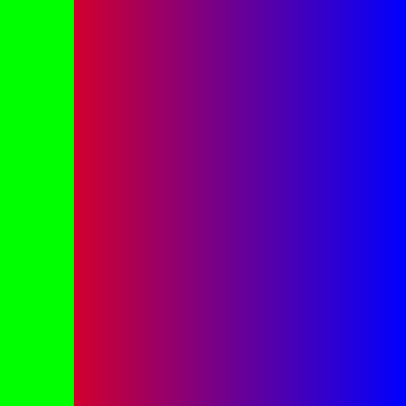 | 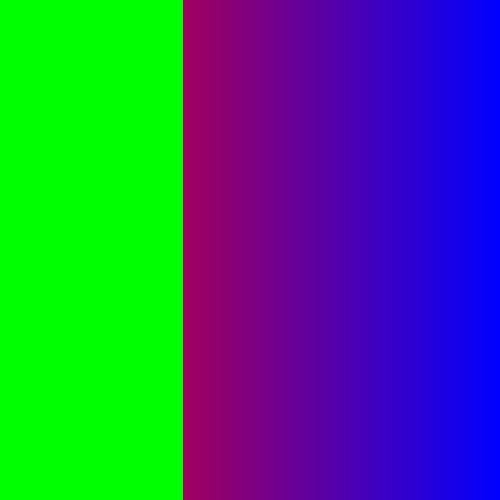

### Transparency with Different Tolerances

```bash
pngtools -i color_test.png -o trans_t5.png -p transparent --color FF0000 --tolerance 5
pngtools -i color_test.png -o trans_t15.png -p transparent --color FF0000 --tolerance 15
pngtools -i color_test.png -o trans_t30.png -p transparent --color FF0000 --tolerance 30
```

Original | Tolerance 5 | Tolerance 15 | Tolerance 30
:-------:|:-----------:|:------------:|:------------:
 |  |  | 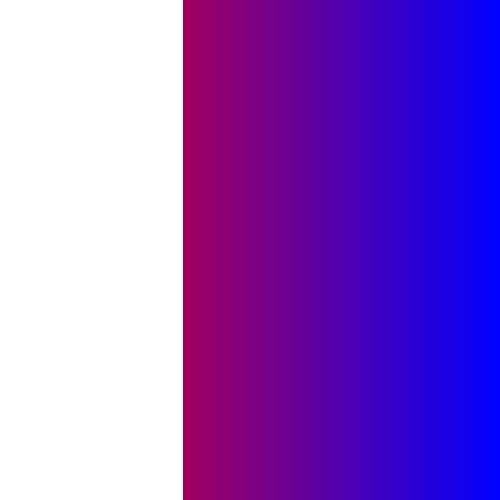

### Compression Testing

```bash
pngtools -i large_image.png -o comp_10.png -p compress --level 10
pngtools -i large_image.png -o comp_30.png -p compress --level 30
pngtools -i large_image.png -o comp_50.png -p compress --level 50
pngtools -i large_image.png -o comp_70.png -p compress --level 70
pngtools -i large_image.png -o comp_90.png -p compress --level 90
```

Original | 10% Compression | 30% Compression | 50% Compression | 70% Compression | 90% Compression
:-------:|:---------------:|:---------------:|:---------------:|:---------------:|:---------------:
 |  | 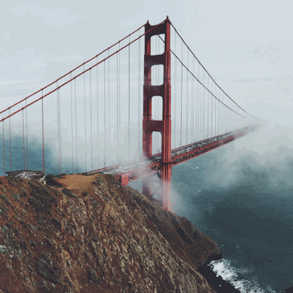 | 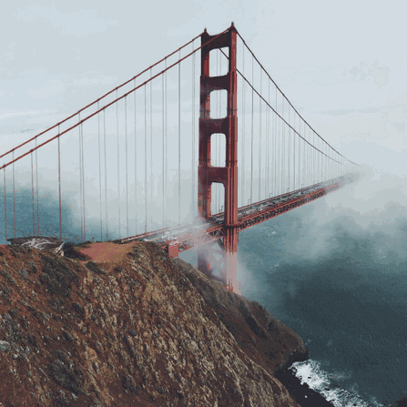 | 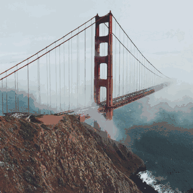 | 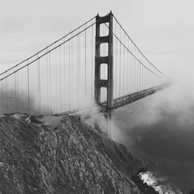

> **Warning:** Visual differences may be subtle or not visible in the preview images, but file size differences will be significant. Higher compression levels may introduce quality loss, especially at 70% and 90%.

### Text Hiding with Different Image Sizes

```bash
pngtools -i small.png -o small_hidden.png -p hide-text --message "Short message"
pngtools -i medium.png -o medium_hidden.png -p hide-text --message "This is a medium length message with some details."
pngtools -i large.png -o large_hidden.png -p hide-text --message "This is a longer message that contains more information. It should test the capacity of the steganography algorithm to hide larger amounts of text data within the image pixels."
```

Small Original | Small with Hidden Text
:-------------:|:---------------------:
 | 

Medium Original | Medium with Hidden Text
:--------------:|:----------------------:
 | 

Large Original | Large with Hidden Text
:-------------:|:---------------------:
 | 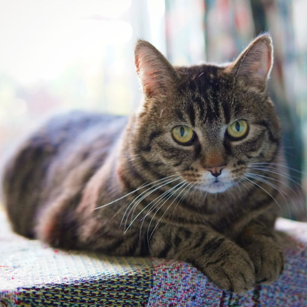

> **Note:** Images with hidden text will appear identical to their originals. The text is encoded at the pixel level and is not visible to the human eye. Larger images can store more hidden text.

## Edge Cases

### Operations on Tiny Images

```bash
pngtools -i tiny.png -o tiny_processed.png -p pixelate --size 2
```

Before | After
:-----:|:-----:
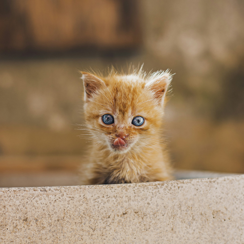 | 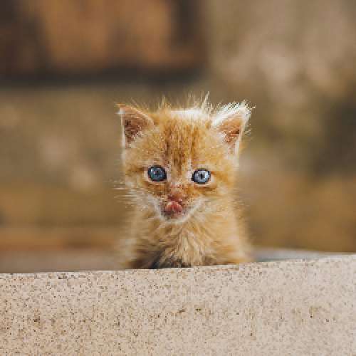

### Operations on Very Large Images

```bash
pngtools -i very_large.png -o large_processed.png -p compress --level 80
```

Before | After
:-----:|:-----:
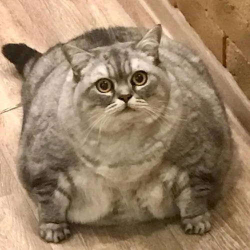 | 

> **Tip:** Processing very large images may take significant time and memory. Consider using compression before other operations for better performance.

### Extreme Blur

```bash
pngtools -i test.png -o extreme_blur.png -p blur --radius 50
```

Before | After
:-----:|:-----:
 | 

### Extreme Noise

```bash
pngtools -i test.png -o extreme_noise.png -p noise --amount 100
```

Before | After
:-----:|:-----:
 | 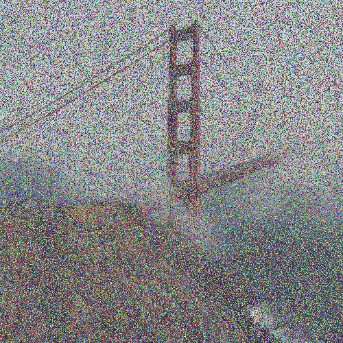

## Image Creation Pipeline

```bash
pngtools -i base.png -o step1.png -p swap-color --from FFFFFF --to FFFF00 --tolerance 10
pngtools -i step1.png -o step2.png -p border --thickness 5 --color FF0000
pngtools -i step2.png -o step3.png -p round-corners --cornerradius 15
pngtools -i step3.png -o step4.png -p text --text "Test Complete" --color 000000 --size 24 --bold --x 20 --y 20
pngtools -i step4.png -o final.png -p compress --level 30
```

Base | Step 1 | Step 2 | Step 3 | Step 4 | Final
:---:|:------:|:------:|:------:|:------:|:-----:
 |  | 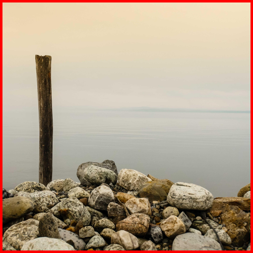 | 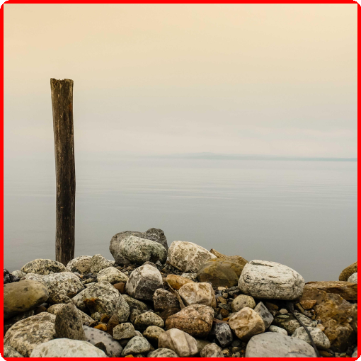 | 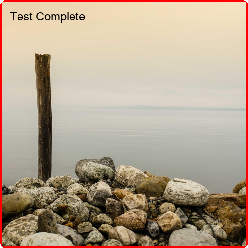 | 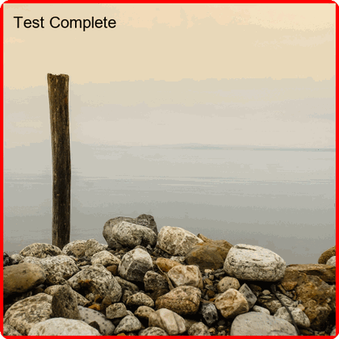

