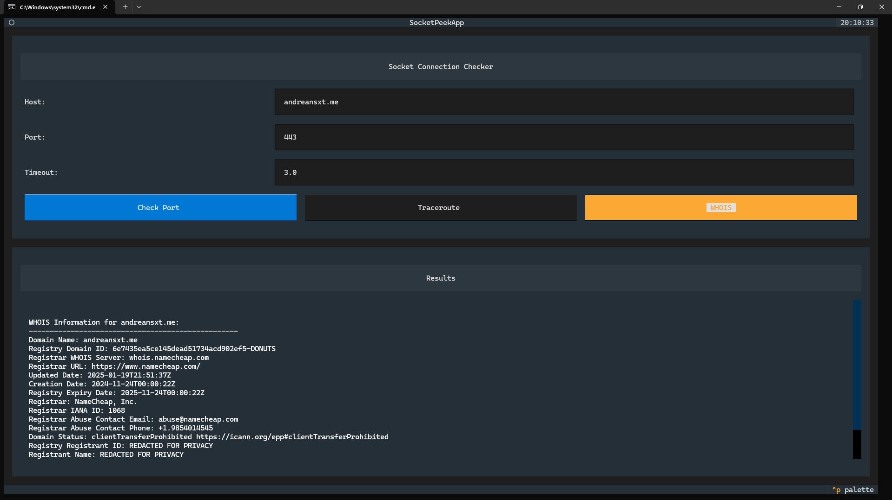
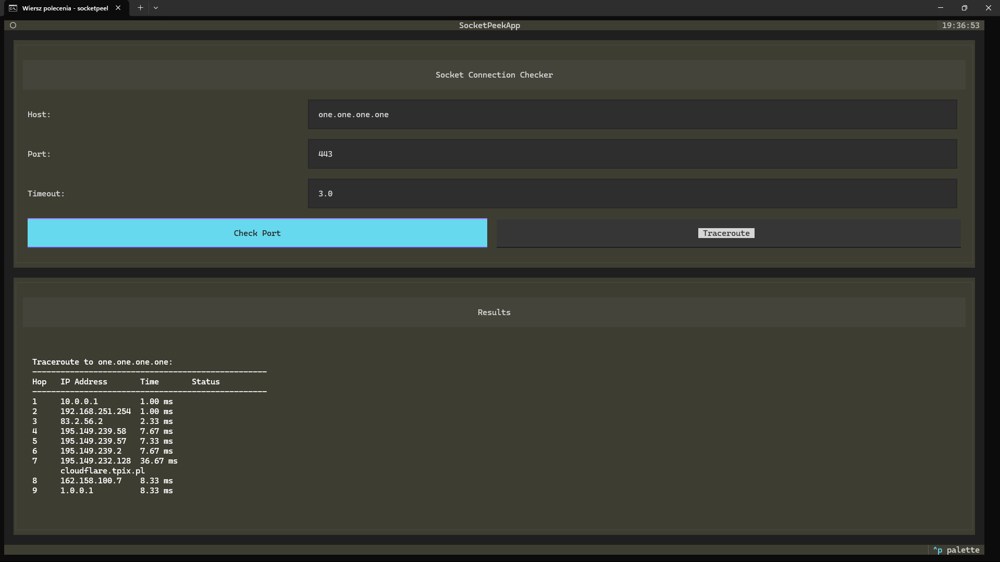

# ⚡ SocketPeek ⚡

A network utility tool made for the Terminalcraft event from Hackclub. Made using Python. 🐍

## 🚀 Installation

### 🛠️ Development Installation

1.  Clone this repository:
```
git clone https://github.com/AndreansxTech/socketpeek.git
cd socketpeek
```

2.  Install in development mode:
```
pip install -e .
```

### ✅ Regular Installation

You can install directly from the repository:
```
pip install git+https://github.com/AndreansxTech/socketpeek.git
```

## 💡 Usage

### 🖥️ Text User Interface (TUI)

Simply run the command without arguments to launch the interactive interface:
```
socketpeek
```

The TUI provides a user-friendly interface where you can:
-   Enter the host (IP or domain name) 🌐
-   Specify the port number 🚪
-   Set the connection timeout ⏱️
-   Check port status or run a traceroute 🔎
-   View results in a tabbed interface 📑

### ⌨️ Command Line Interface (CLI)

You can use the tool from the command line for port checking:
```
socketpeek port <host> <port> [options]
```

Or for traceroute:
```
socketpeek trace <host> [options]
```

For backward compatibility, the old format still works:
```
socketpeek <host> <port> [options]
```

Examples:
```
socketpeek port google.com 80
socketpeek trace example.com
socketpeek trace 192.168.1.1 --max-hops 15 --timeout 2
```

### 🔌 Port Check Options

-   `<host>`: The host address (IP or domain name)
-   `<port>`: The port number (1-65535)
-   `-t, --timeout`: Optional. Connection timeout in seconds (default: 3.0)

### 🗺️ Traceroute Options

-   `<host>`: The host address (IP or domain name)
-   `-m, --max-hops`: Optional. Maximum number of hops (default: 30)
-   `-t, --timeout`: Optional. Timeout for each hop in seconds (default: 1.0)

## ✨ Features

-   Text-based user interface for interactive use 💻
-   Command-line interface for scripting and quick checks ⌨️
-   Port status checking 🚪
-   Network route tracing (traceroute) 🗺️
-   Color-coded output for better readability 🌈
-   Detailed error messages ⚠️
-   Configurable timeouts and hop limits ⏱️

## Screenshots





## ⚙️ Requirements

-   Python 3.6+ 🐍
-   colorama 🎨
-   textual 📰
