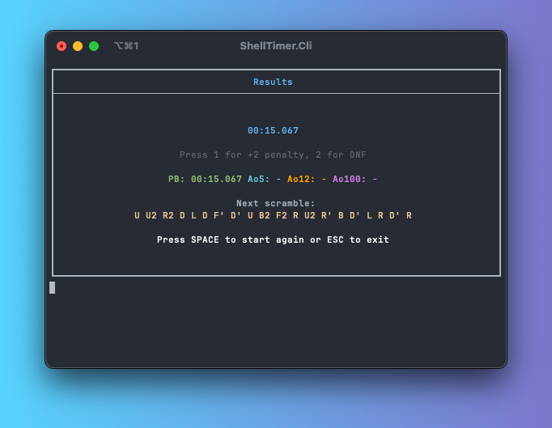
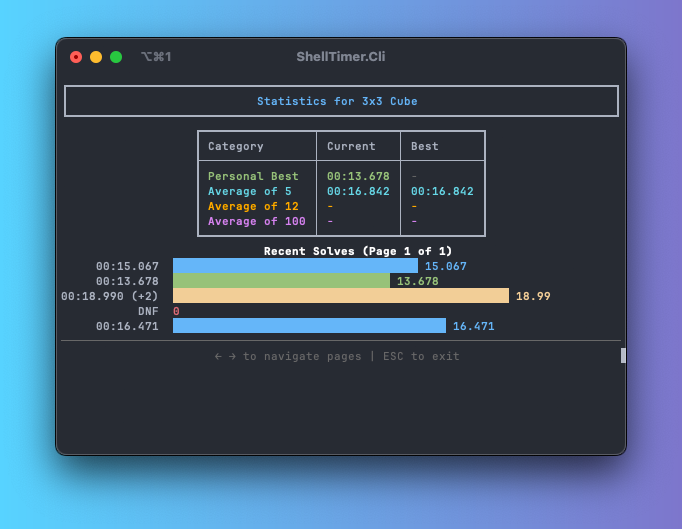

# ShellTimer

A simple speedcubing timer for the command line written in C# using .NET 9.




This project was written for the Hack Club 2025 Terminal Craft YSWS event, and this is my first ever standalone CLI application.

My primary motivation for creating this project was to create something actually useful that I could imagine myself using on a daily basis, as I am also a speedcuber ;)

## Features

- [x] **NEW:** Multiplayer duels in real-time (using WebSockets)
- [x] Support for different cube sizes (2x2, 3x3, 4x4, etc.)
- [x] Configurable inspection time
- [x] Scramble generation
- [x] Support for penalties (+2, DNF)
- [x] Solve history
- [x] Solve statistics (PB, Ao5, Ao12, Ao100)

### Roadmap

- [ ] Add support for taking over a duel (partially implemented on the backend)
- [ ] Add an option to export the solve history to a file
- [ ] Add support for multiple sessions
- [ ] Add an algorithm practice tool
- [ ] Add support for different puzzles (e.g. Skewb, Pyraminx)
- [ ] Add a scramble visualizer (using the Spectre.Console Canvas API)

## Building

1. Ensure you have [.NET 9 SDK](https://dotnet.microsoft.com/en-us/download/dotnet/9.0) installed:
   ```bash
   dotnet --version
   ```

2. Clone the repository:
   ```bash
   git clone https://github.com/Xeretis/ShellTimer.git
   cd ShellTimer
   ```

3. Build the project:
   ```bash
   dotnet build
   ```

4. Run the application (for development only):
   ```bash
   cd ShellTimer.Cli && dotnet run
   ```

## Running the backend in development (optional)

```bash
cd ShellTimer.WebApi && dotnet run
```

After running the command above, the backend should be accessible at `http://localhost:5212`, set this as your duel service url using the `config` command. 

## Running the backend in production

1. Make sure you have [Docker](https://docs.docker.com/engine/install/) and [Docker Compose](https://docs.docker.com/compose/install/) installed:
   ```bash
   docker compose
   ```
2. Run the docker compose defined at the root of the repository:
   ```bash
   docker compose up -d
   ```
   
The backend should now be accessible on `http://0.0.0.0:8080`. I recommend adding a reverse proxy in front of the backend in production.

## Usage

Run the application without any commands to see the help menu:

```
USAGE:
    ShellTimer.Cli [OPTIONS] <COMMAND>

OPTIONS:
    -h, --help    Prints help information

COMMANDS:
    timer       Start timing solves
    scramble    Generate scrambles for a specific cube size
    solves      Manage solve records
    stats       Show statistics for a specific cube size
    duel        Duel an other ShellTimer user in real-time
    config      Configure ShellTimer with application wide settings
```

```
DESCRIPTION:
Manage solve records

USAGE:
    ShellTimer.Cli.dll solves [OPTIONS] <COMMAND>

OPTIONS:
    -h, --help    Prints help information

COMMANDS:
    list           List all solve records
    delete <id>    Delete a solve record by its ID
    clear          Clear all solve records from the database
```

If you want to know more about a specific command, pass the `help` flag to it.

For example: `./ShellTimer timer -h` (Please note that when running in development, you should only pass flags after `--` like so: `dotnet run timer -- -h`)

## Notable dependencies

- [Spectre.Console](https://spectreconsole.net/) - Terminal UI library
- [SQLite-net](https://github.com/praeclarum/sqlite-net) - SQLite ORM
