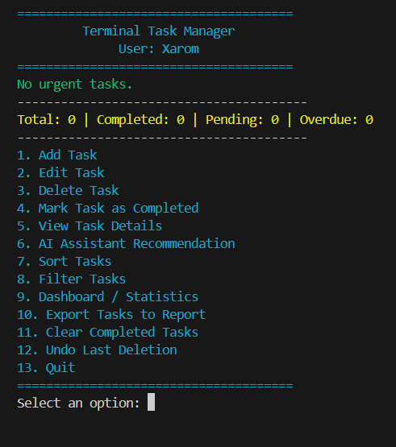

# Task Board📝

**TaskBoard** is a console application designed to help manage daily tasks. Its main goal is to provide simplicity and clarity for the user.

The core features of the application include the ability to add tasks, write descriptions, assign tasks to specific individuals, and set priorities. Based on this information, tasks can be sorted, and the most important task can be selected for completion. The application also uses colors to enhance the visual clarity of the program. Below is a preview of how the main menu looks:

The program is written in Python and uses basic libraries. Tasks are stored in a tasks.json file, and the username is saved in username.txt. To install the application, all you need to do is install the dependencies from the requirements.txt file and run the program in Python.
