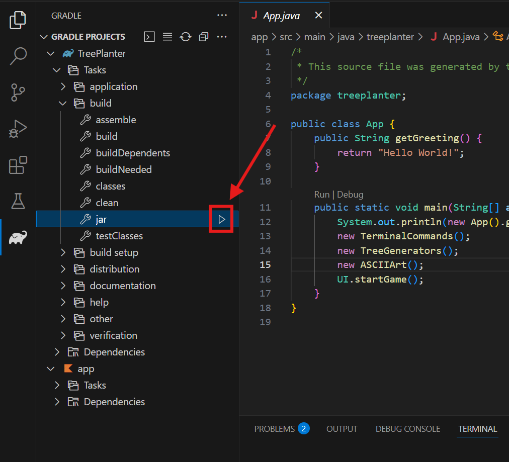

# Tree Planter

A make number bigger and smaller game.

## How to run

1. Fufill the requirements [here](#requirements)
2. Then download the `app.jar` file from [releases](https://github.com/101zh/TreePlanter/releases)
3. After that run this command with java

```bash
C:> java -jar path\to\app.jar
# Just by the way "path\to" is just the file path to the jar file wherever it is downloaded to on your device
```

4. Now you can play the game. Enjoy! (☆▽☆)

## How to build

1. Fufill the [workspace requirements](#workspace) below.
2. Open the folder containing the workspace containing this project.
3. Wait for the workspace to initialize and for gradle to configure the project.
4. Build a jar using Gradle for Java

5. Then find the `app.jar` file in  the folder `TreePlanter/app/build/libs`
6. Now you can run the `app.jar` file using a terminal

## Requirements

- Have at least Java JRE 17 installed
- Have a terminal to run the command in

## Workspace

- VS Code
- Java JDK 17
- [Extension Pack for Java](https://marketplace.visualstudio.com/items?itemName=vscjava.vscode-java-pack) by Microsoft
- [Gradle for Java](https://marketplace.visualstudio.com/items?itemName=vscjava.vscode-gradle) Extension
