# WorseTerminal

A custom terminal with custom commands including a 'bughunt' game where you find bugs in snippets of code.
Create your own levels by reading /WorseTerminal/bughunt_level_guide.md

# Dependencies

* Colorama
* Termcolor

# Previews
## Windows
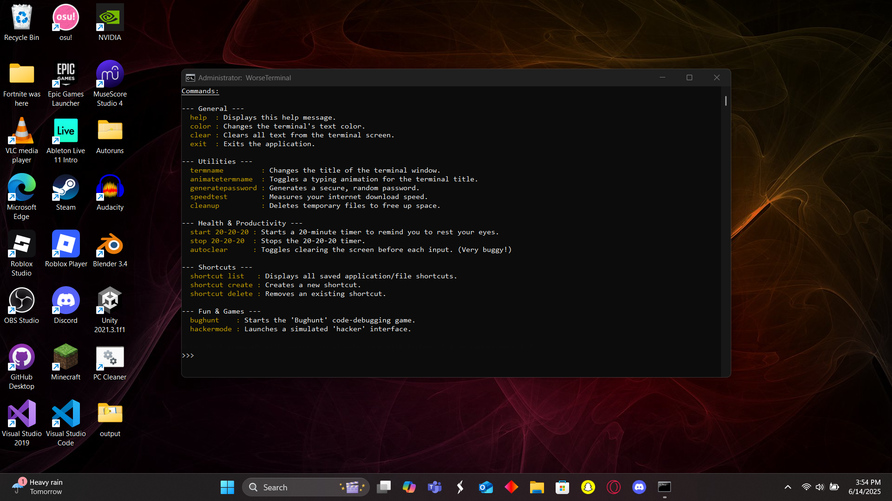
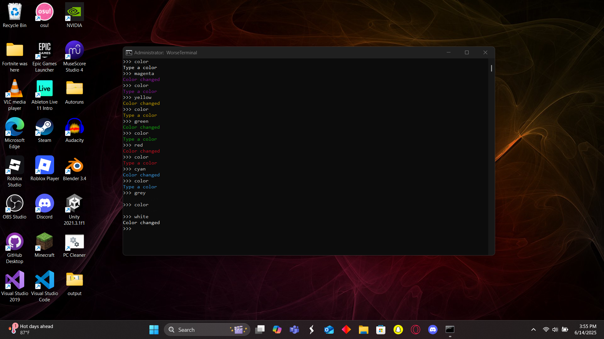
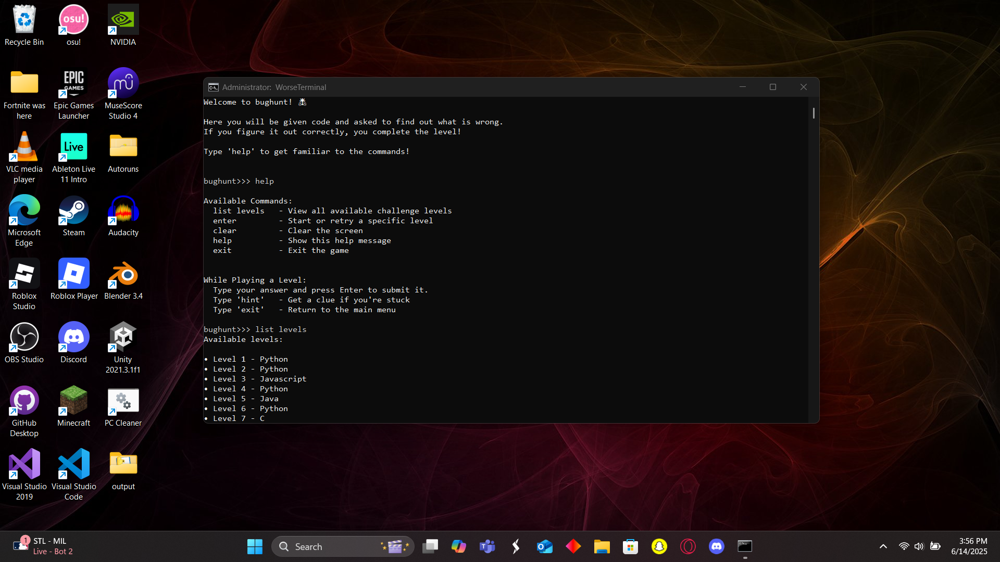
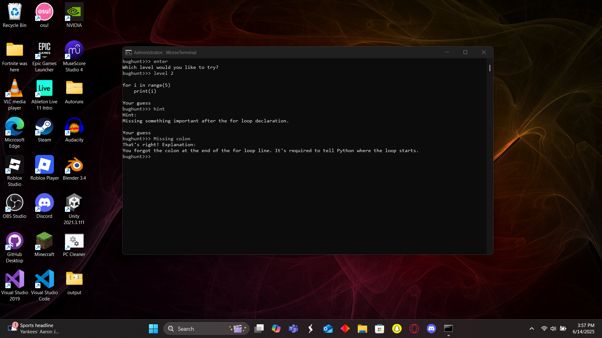
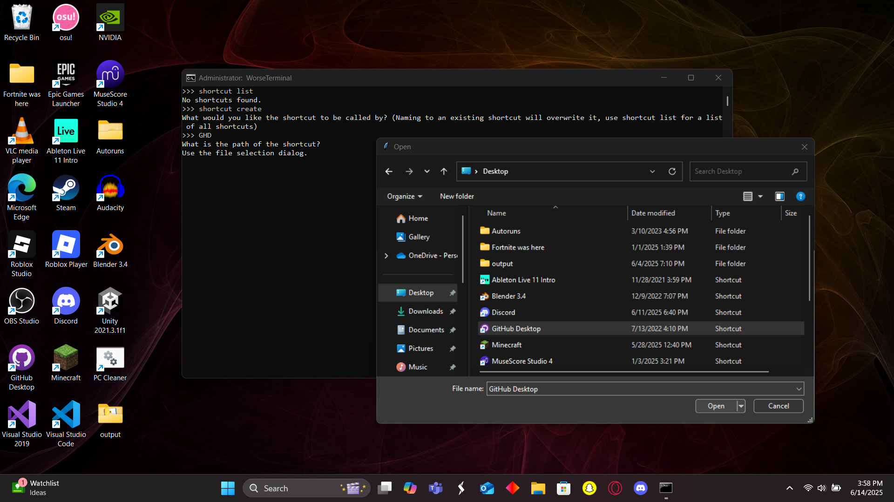

## Linux
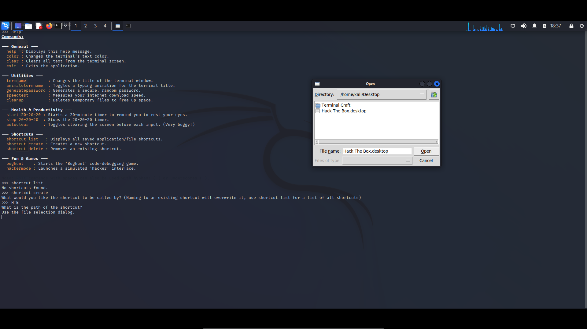
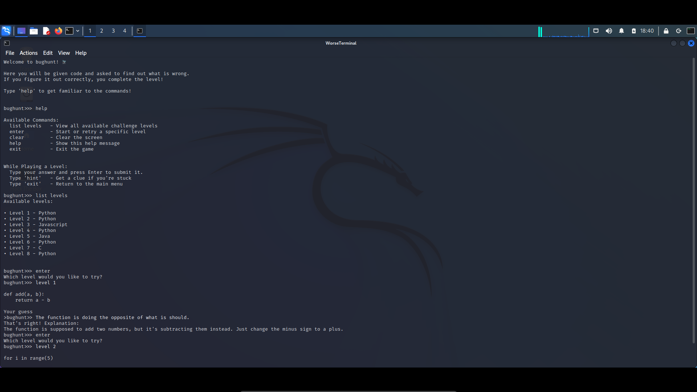
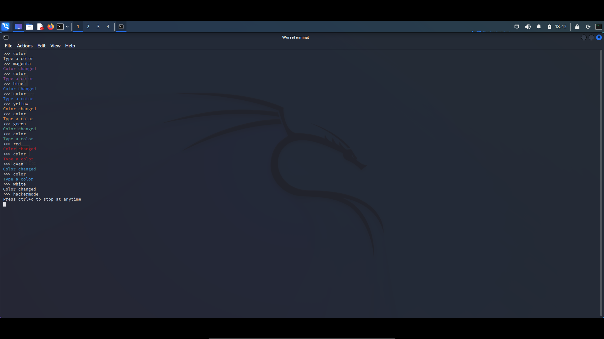

## MacOS
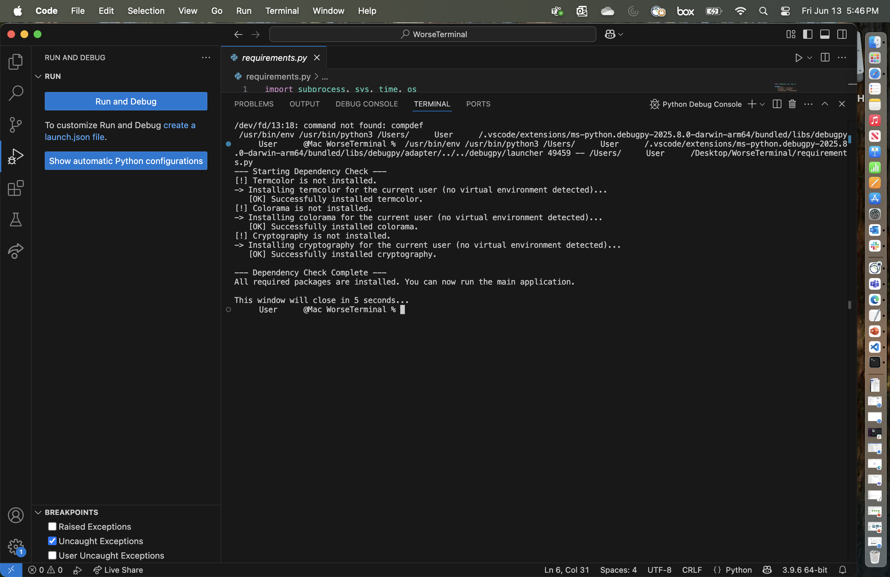
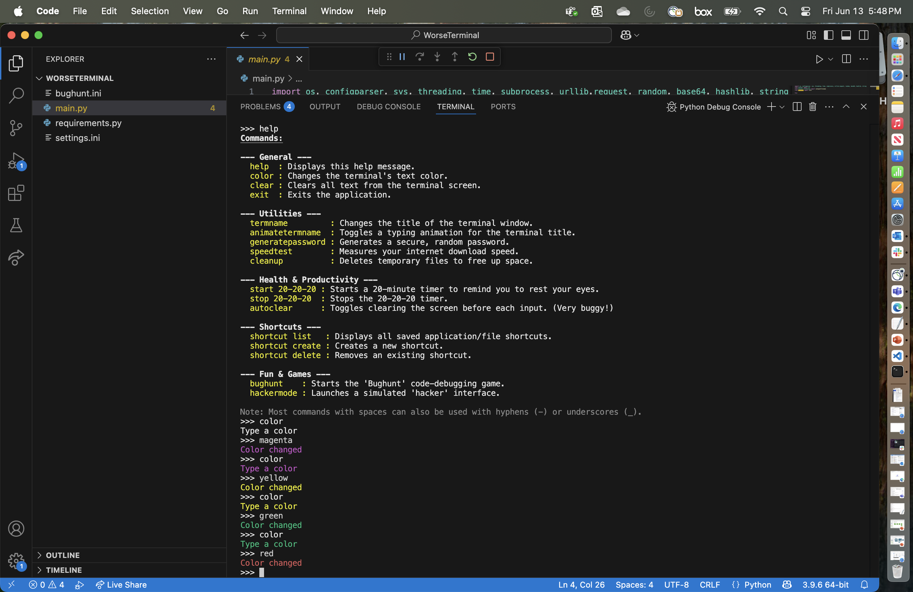
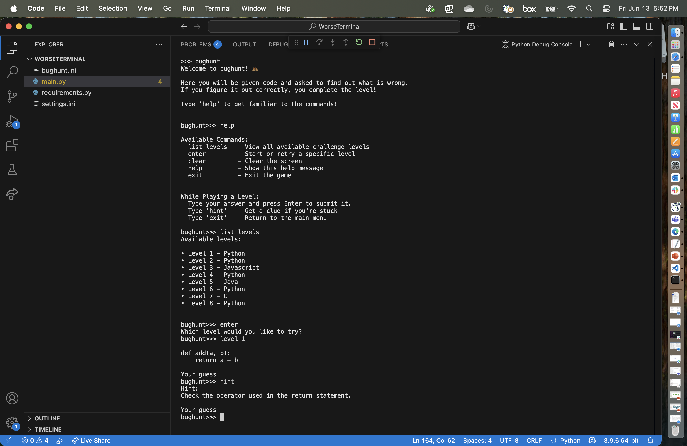

# Installing

* Click the green '\<\> Code' button

* Next click on Download ZIP

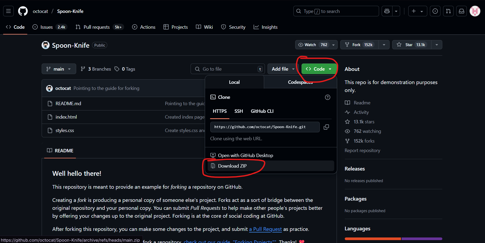

* Unzip the downloaded ZIP file

* Delete this README.md and the images folder, run requirements.py, run main.py, and enjoy!

## Authors

Tharakesh Rajesh

## Acknowledgments

* [CodeBeatifier](https://codebeautify.org/python-formatter-beautifier)
