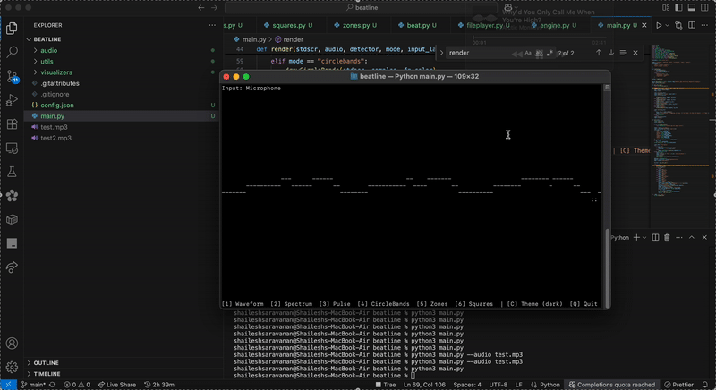

# Beatline 🎶

Beatline is a terminal-based real-time music visualizer. It captures audio (via microphone or file) and renders various visualizations like waveform, spectrum bars, pulse matrix, radial rings, and frequency zones right inside your terminal.

---

## 🔧 Features
- **Waveform**: See the audio waveform in real time.
- **Spectrum**: Bar graph showing frequency distribution.
- **Pulse**: Radial pulses synced to audio volume.
- **CircleBands**: Circular visual representation of energy bands.
- **Zones**: Frequency-labeled horizontal bands (SUB, BASS, MIDS, TREBLE).
- **Squares**: Intensity-based glowing quadrants.

---

## ▶️ How to Run

```bash
git clone https://github.com/yourname/beatline.git
cd beatline

pip install -r requirements.txt

python3 main.py

python3 main.py --audio path/to/file.mp3
```

⸻

## Demo


⸻

⚙️ Requirements
	•	Python 3.8+
	•	numpy
	•	sounddevice
	•	soundfile
	•	blessed
	•	curses (builtin on macOS/Linux)

macOS users must grant microphone permissions and optionally install BlackHole to capture system audio.

⸻

💡 Why I Created It

I wanted a fun, fast, hackable music visualizer that could run directly in a terminal, without GUI frameworks or external displays. This was also a great way to explore audio processing and terminal graphics together.