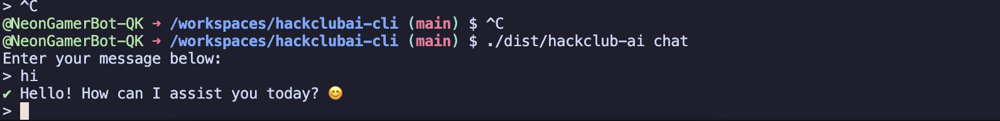

# Hackclub AI CLI

Hackclub AI CLI is a command-line interface for interacting with Hackclub's AI services. This tool allows you to perform various actions such as getting stats, sending greetings, and starting chat sessions directly from your terminal.



## Features

- **Help**: Prints a help message with available commands.
- **Hey**: Prints a greeting message.
- **Stats**: Fetches and displays usage statistics from ai.hackclub.com.
- **Chat**: Starts an interactive chat session with the AI.

## Installation

To install the Hackclub AI CLI, you need to have [Deno](https://deno.land/) installed. Once you have Deno, you can compile the CLI using the following command:

```sh
deno compile --allow-env --allow-net --allow-run --output dist/hackclub-ai main.ts