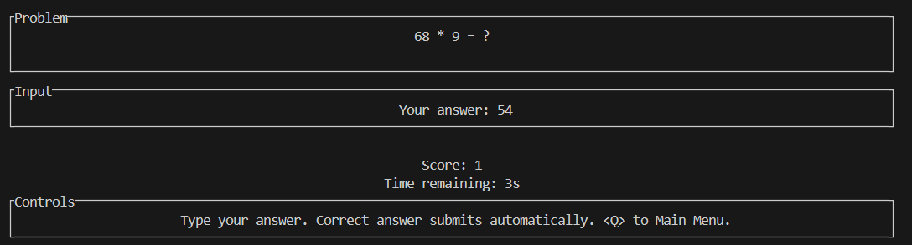
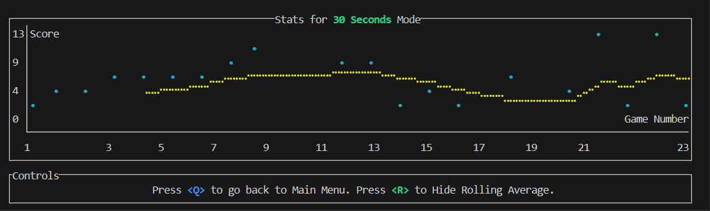
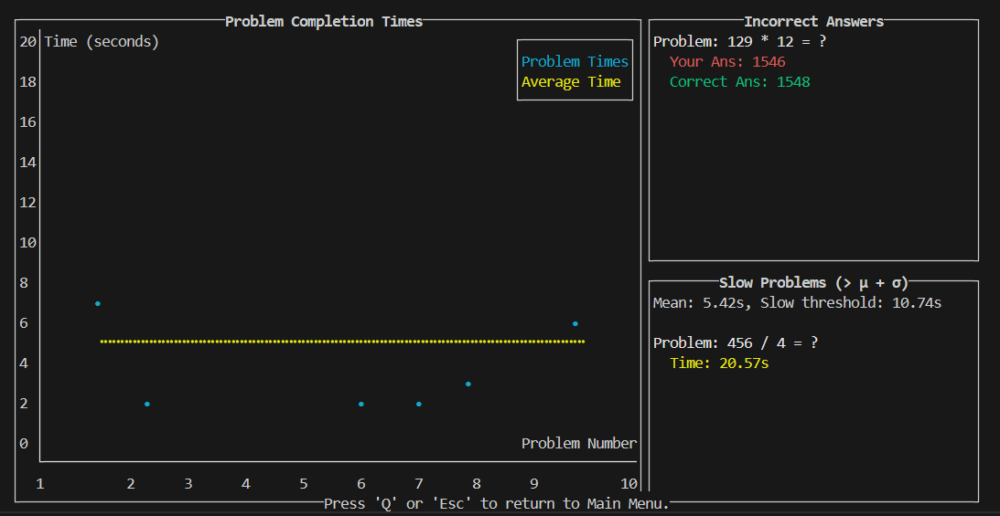

# Terminal Craft

A terminal-based mental arithmetic practice game built with Rust and [Ratatui](https://ratatui.rs).

## Features

- Practice mental arithmetic with customizable difficulty
- Track your performance with detailed statistics
- Configure game settings to match your skill level
- Beautiful terminal user interface
- JSON-based persistence for settings and statistics

## Installation

### Prerequisites

- Rust toolchain (install from [rustup.rs](https://rustup.rs))

### Building from source

1. Clone the repository:
```bash
git clone <repository-url>
cd terminal-craft
```

2. Build and run:
```bash
cargo run
```

## Screenshots

### Problem Screen


### Statistics View


### Detailed Round Information


### Settings


