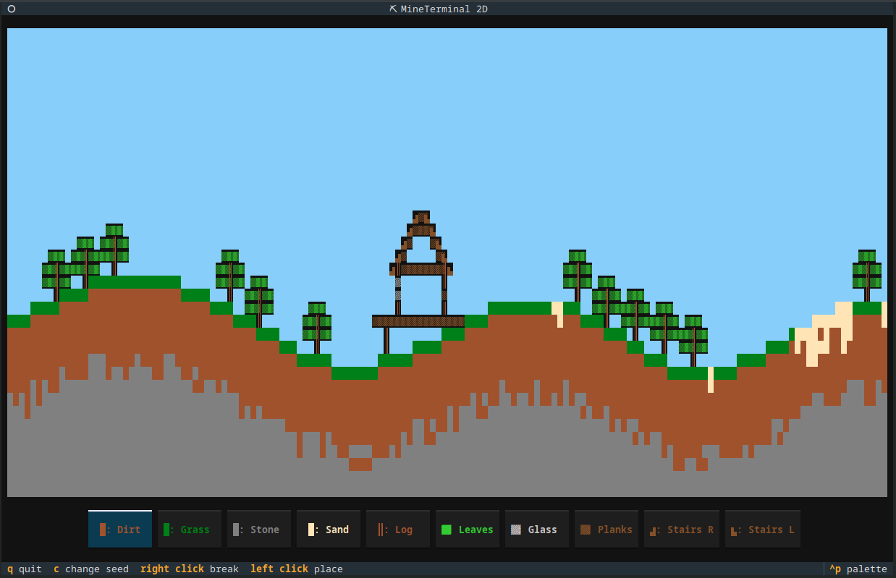

# MineTerminal 2D

This Python program using Textual allows you to play around in a canvas resembling a 2D sandbox game world.

Features:

- random world generation with a seed
- saving/loading
- 10 different blocks

Controls are described on the game welcome screen - it's basically just using the arrow keys and left/right click.

The welcome screen can be skipped by starting the TUI with `python main.py skip`.

## How to run

1. Install Python 3 (I used 3.13, but I think at least 3.8+ should be compatible)
2. Clone this repo and set up a virtual env by running `python -m venv .venv` in this folder.
3. Activate the venv with `source .venv/bin/activate` (for bash - depending on your shell/OS this might be different)
4. Install the required dependencies in the activated venv with `pip install -r requirements.txt`
5. Start the app with `python main.py`.
