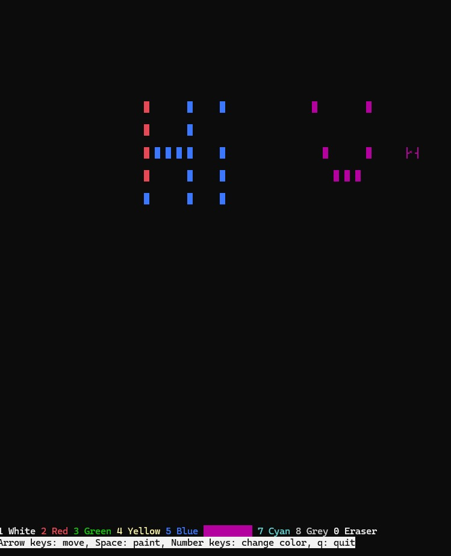
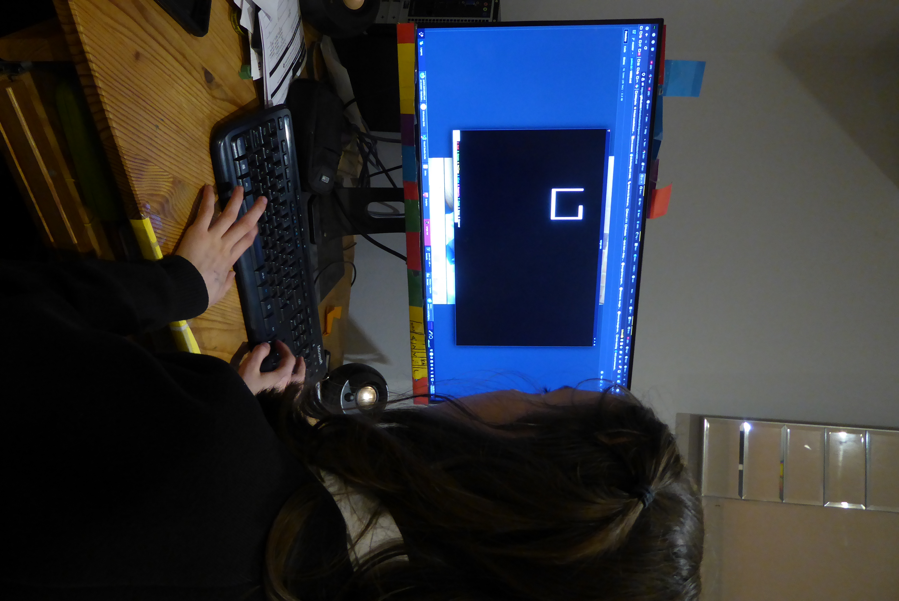
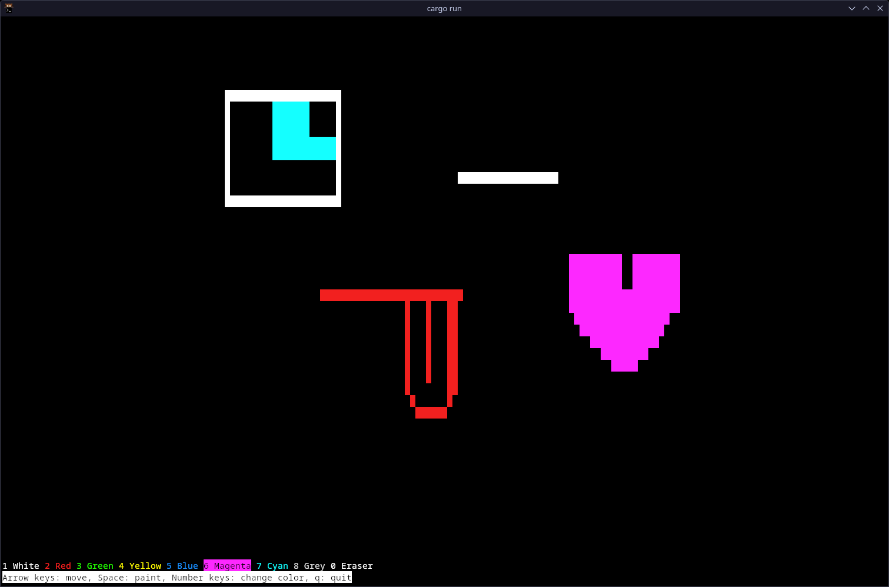
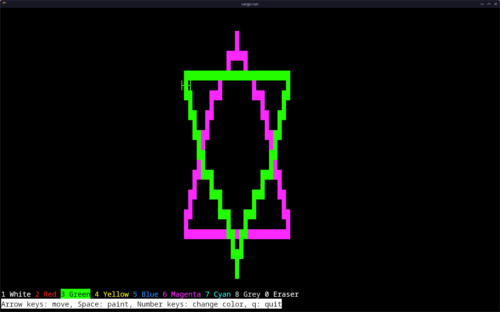

# Users of Paint 2D

Various people have used Paint 2D, including some beta testers who have provided me feedback and found bugs. This document contains some evidence to show that a number of users have used the project.

If you'd like to be added to the list, feel free to submit a PR that adds a section for you. You can mention your OS, terminal, and any notes, and a screenshot would be great too!

## Beta test for v0.2.0 on Windows

We tested an in-development version of v0.2.0 (commit 8cccffbb286eeaf8748dff819900b56e87bf9cc0) on a PC running Windows 10 22H2 (19045.5487). We ran the EXE file directly by double-clicking it.

### General notes

This was the first time testing the program on a native Windows machine, and it opened successfully. There were two issues that weren't experienced when testing in Linux:

- The screen took a while to refresh whenever the cursor was moved, so the experience was a bit janky
- The cursor moved on key up and on key down, which meant that the cursor moved twice for each key press

However, all the users adapted very well to those quirks, and still managed to enjoy using it.

### User 1

### Poppy (User 2)

### User 3

### User 4

### User 5

### User 6

## James (user 7) running v0.1.0

James ran the v0.1.0 (the latest release version at the time) on Windows 10 and Linux. He noted that it was much smoother on Linux than on Windows (as we had found [earlier](#general-notes)).

## Beta test for v0.2.0 on Linux

We tested version 0.2.0 before publishing it on a PC running Arch Linux with the Kitty terminal emulator.

### Karolina (user 8)

### User 9

