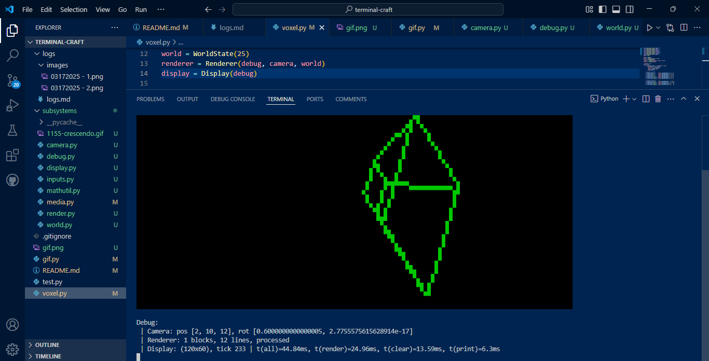
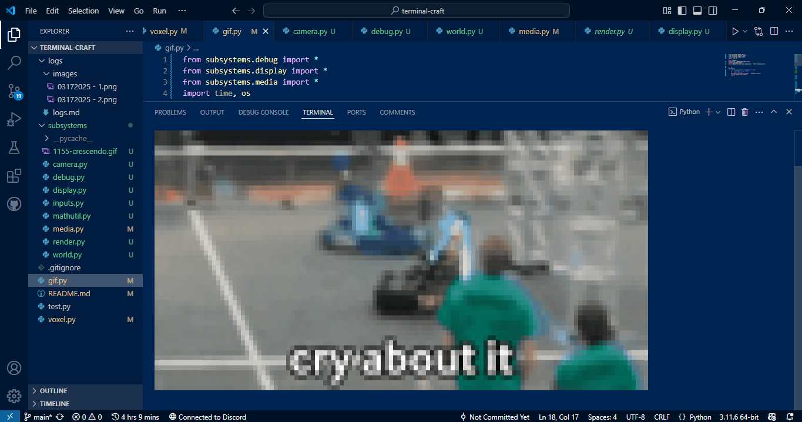

# terminal-craft

*@HenryLi-0 submission for a Hack Club YSWS!*

**EPILEPSY WARNING! THIS HAS A LOT OF FLASHING COLORS!**

About:

- Unfortunately very laggy, as terminals aren't exactly meant to be pixel displays.

- Uses tons of color sequences to mimic a pixel display! 

- Run `voxel.py` for a cube renderer, that also behaves as if you had eyes behind your back.

- Run `gif.py` for a GIF renderer, that renders GIFs in the terminal.

- Higher resolutions are possible, but it's really laggy.

- Huge thanks to [this stackoverflow thread](https://stackoverflow.com/questions/4842424/list-of-ansi-color-escape-sequences) for all the colored texted related things!