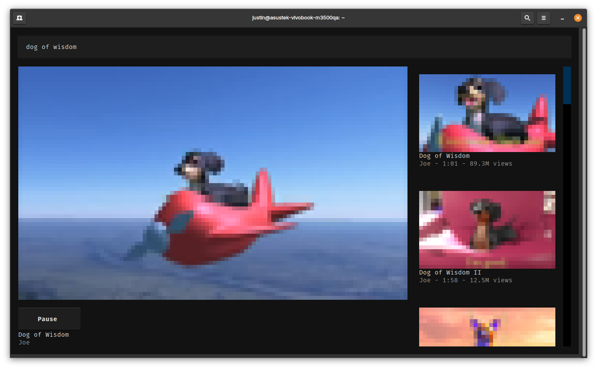

# youtube-terminal
Watch YouTube on your terminal (for whatever reason you have)

# Get Started
- Clone Repo
- Check that required FFmpeg libraries are installed on your system 
- Install Python > 3.12 and run `pip install -r requirements.txt` (venv recommended!)
  - If you get build errors with ffpyplayer, ffmpeg libs are not installed properly!
- Run app.py

# Notes
- The client is insanely unoptimised. For now, a moderately powerful computer is recommended (mainly tested with a Ryzen 5 5600H + Integrated Graphics) for "tolerable" performance. Limited testing has been done with Mac devices. More work can definitely be done to optimise the video playback
- Textual was a pain in the bum to work with, will likely need a rewrite to make playback smoother. Playing back video without the GUI overheads is really smooth even on low spec computers. I was planning to not use Textualize, but I was already this far in. Too bad!